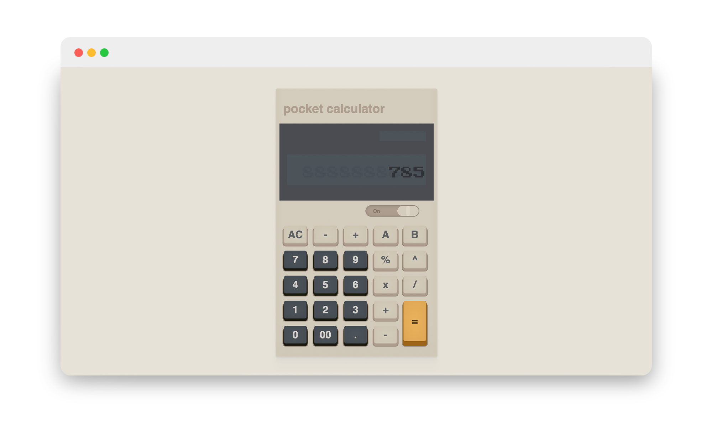
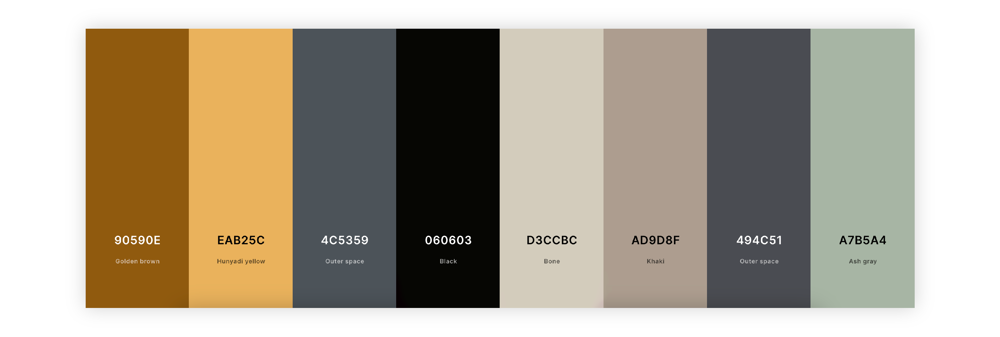

# The Odin Project: Calculator Final Foundatinos Project

In developing my calculator project with JavaScript, I utilized several fundamental concepts and techniques to create a functional and interactive user interface. I heavily relied on DOM manipulation to access and modify elements on the webpage using `document.getElementById()`. This allowed me to retrieve buttons for numerical inputs and operations, as well as the screen display where results were shown to the user.

  

Event handling played a crucial role in enabling user interaction. I implemented event listeners on buttons, from numeric digits to mathematical operations, to respond to user clicks. These listeners triggered specific functions like `setNumber()` for entering digits and managing operations such as addition, subtraction, multiplication, division, percentage calculations, and square root computations. Managing variables and their scopes was essential to maintain the calculator's state throughout different operations. Variables like `firstNumber`, `secondNumber`, `operation`, and `output` stored and processed user inputs and results dynamically. I used conditional statements to control the flow of operations based on conditions such as whether the calculator was active or if an operation was selected (`operation !== ''`).

Throughout the project, I also applied string manipulation techniques, such as concatenation to build dynamic numbers and slicing strings to limit displayed digits, ensuring a clean user interface. Error handling was implemented to manage scenarios like division by zero and to handle long numbers through exponential notation for display. Overall, my calculator project effectively demonstrated how JavaScript can be used to create interactive web applications, combining DOM manipulation, event handling, conditional logic, and mathematical operations to deliver a seamless user experience.

### CSS

To structure the calculator visually, I utilized CSS positioning and flexbox for layout control. The calculator body was styled with a specific width, background color, padding, and border radius to achieve a cohesive design. Box shadows were added to enhance its appearance, creating a subtle depth effect. For the screen area, I employed absolute positioning to place it correctly within its container, setting its background color and ensuring it remained visually distinct. Elements within the screen, such as the display text and LED-like indicator, were styled for readability and aesthetic coherence, with appropriate font choices and text alignment.

  

In crafting the CSS for my calculator project, I focused on defining variables for consistent color usage and applied them throughout the stylesheet using CSS custom properties. These variables were set for various color themes, such as gold and black, as well as for the overall body and button background colors. Button colors and gradients were dynamically adjusted based on the selected theme using CSS classes (black, gold), altering properties like text color, background gradients, and bottom shadows.

Buttons were a significant focus, designed to be interactive and visually appealing. I structured the buttons on my calculator using a layered approach to achieve distinct visual effects. Each button consists of multiple layers: a top layer for the button's text and design, a bottom layer for subtle shading and depth, and a base layer for foundational color and shadow. As mentioned earlier, the buttons are categorized into gold and black themes, each defined by unique color variables for consistency and customization. This approach not only ensures a polished appearance but also allows for easy modification and maintenance across the calculator's interface.

Overall, this approach to CSS styling enabled me to create a functional and visually engaging calculator interface, leveraging variables, positioning techniques, and thematic styling to ensure a consistent and user-friendly design.

 

<h3>CSS, JavaScript Concepts Applied</h3>

- if/else statements
- for loop
- .classList.add()
- .style
- .appendChild
- .addEventListner
- .querySelectorAll  
- flex box
- position: absolute / relative
- z-index
- transition on active states (buttons)

 

I am really really stoked at how this project came out! I had a lot of fun playing with the CSS on this one to make it just how I envisioned it!